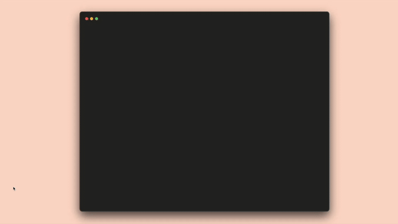

# Google Slides MCP Server



A production-ready MCP (Model Context Protocol) server that provides semantic, developer-friendly access to the Google Slides API. Available as both a Python package for local use and a Cloudflare Workers deployment for remote access.

## Features

- **Full API Access**: Direct passthrough to all 47 Google Slides API request types via `batch_update`
- **Semantic Positioning**: Human-friendly tools that abstract away EMU math and transform calculations
- **Template Workflows**: Copy templates, replace placeholders with text or images
- **OAuth Support**: Per-user authentication for multi-user scenarios
- **Two Deployment Options**:
  - **Python (FastMCP)**: Local stdio transport for Claude Desktop/Code
  - **Cloudflare Workers**: Remote SSE transport for Claude Mobile and web clients

## Quick Start

### Option 1: Cloudflare Workers (Remote)

Connect Claude Desktop or Claude Mobile to the hosted server:

```
URL: https://google-slides-mcp.foray-consulting.workers.dev/sse
```

No local installation required - just add as a custom connector and authenticate with your Google account. The hosted server is publicly accessible to any Google user.

> **Note:** On first authentication, you'll see a "This app isn't verified" warning from Google. Click **Advanced** → **Go to Google Slides MCP (unsafe)** to proceed. This is normal for apps that haven't completed Google's verification process.

### Option 2: Python (Local)

```bash
cd packages/python
pip install -e ".[dev]"

# Acquire OAuth tokens
python scripts/get_token.py

# Run the server
google-slides-mcp --transport stdio
```

## Repository Structure

```
google-slides-mcp/
├── packages/
│   ├── python/                 # Python FastMCP implementation
│   │   ├── src/google_slides_mcp/
│   │   │   ├── tools/          # All 22 MCP tools
│   │   │   └── prompts/        # Workflow and discovery prompts
│   │   ├── scripts/
│   │   ├── tests/
│   │   └── pyproject.toml
│   │
│   └── cloudflare/             # Cloudflare Workers implementation
│       ├── src/
│       │   ├── index.ts        # OAuthProvider entry point
│       │   ├── mcp-agent.ts    # McpAgent Durable Object
│       │   ├── api/            # Google API REST clients + TokenManager
│       │   ├── auth/           # Google OAuth handler
│       │   ├── tools/          # All 21 MCP tools
│       │   ├── prompts/        # Workflow and discovery prompts
│       │   └── utils/          # EMU, color, transform utilities
│       ├── wrangler.toml
│       └── package.json
│
├── docs/
│   ├── development_history.md
│   └── google-oauth-setup.md
└── README.md
```

## Available Tools (21 total)

### Low-Level Tools
- `batch_update` - Execute raw batchUpdate requests against Google Slides API
- `get_presentation` - Retrieve presentation metadata, slides, and elements
- `get_page` - Get detailed information about a specific slide

### Template Tools
- `copy_template` - Copy a Google Slides template to create a new presentation
- `replace_placeholders` - Replace placeholder text throughout a presentation
- `replace_placeholder_with_image` - Replace placeholder shapes with images
- `search_presentations` - Search for presentations in Google Drive

### Positioning Tools
- `position_element` - Position and size elements using inches and alignment
- `distribute_elements` - Distribute elements evenly across the slide
- `align_elements` - Align multiple elements to each other or the slide

### Creation Tools
- `create_slide` - Create a new slide with a specified layout
- `add_text_box` - Add a styled text box to a slide
- `add_image` - Add an image from a URL
- `add_shape` - Add shapes (rectangle, ellipse, etc.)

### Utility Tools
- `list_slides` - List all slides with IDs and titles
- `get_element_info` - Get element details in human-readable format
- `export_thumbnail` - Generate slide thumbnails

### Content Tools
- `update_slide_content` - Update slide text by placeholder type
- `update_presentation_content` - Bulk update text across multiple slides
- `apply_text_style` - Apply consistent styling across slides

### Analysis Tools
- `analyze_presentation` - Deep-dive style guide extraction

## MCP Prompts (7 total)

The server includes semantic routing prompts that guide LLMs through optimal tool usage:

### Workflow Prompts
- `create_presentation_from_template` - Complete template-based deck creation workflow
- `update_existing_presentation` - Guide for modifying an existing presentation
- `build_presentation_from_scratch` - Create presentations without templates
- `analyze_and_replicate_style` - Extract and apply style guides

### Discovery Prompts
- `get_started` - Introduction to tool landscape and abstraction levels
- `tool_reference` - Detailed tool reference by category
- `troubleshooting` - Common issues and solutions

## Python Package

### Installation

```bash
cd packages/python
pip install -e ".[dev]"
```

### Configuration

1. Create Google OAuth 2.0 credentials at [Google Cloud Console](https://console.cloud.google.com/apis/credentials)
2. Enable the Google Slides API and Google Drive API
3. Copy `.env.example` to `.env` and fill in your credentials

For detailed setup instructions, see [docs/google-oauth-setup.md](docs/google-oauth-setup.md).

### Claude Desktop Configuration

```json
{
  "mcpServers": {
    "google-slides": {
      "command": "google-slides-mcp",
      "args": ["--transport", "stdio"]
    }
  }
}
```

## Cloudflare Workers Package

### Deployment

```bash
cd packages/cloudflare
npm install

# Create KV namespace
npx wrangler kv namespace create "OAUTH_KV"

# Set secrets
npx wrangler secret put GOOGLE_CLIENT_ID
npx wrangler secret put GOOGLE_CLIENT_SECRET
npx wrangler secret put COOKIE_ENCRYPTION_KEY

# Deploy
npm run deploy
```

### Architecture

- **OAuthProvider**: Handles MCP OAuth 2.1 flow with PKCE
- **McpAgent (Durable Object)**: Maintains session state and WebSocket connections
- **Google OAuth Handler**: Upstream authentication with Google
- **Direct REST**: Uses `fetch()` instead of googleapis npm package

### Local Development

```bash
npm run dev        # Start local server on port 8788
npm run typecheck  # Run TypeScript checks
```

## Development

### Python

```bash
cd packages/python
pytest                    # Run tests
ruff check .              # Linting
mypy src/                 # Type checking
```

### Cloudflare

```bash
cd packages/cloudflare
npm run typecheck         # TypeScript checks
npm run dev               # Local development
npm run deploy            # Deploy to Cloudflare
```

## Development History

For a detailed chronology of how this project was conceived and built—from initial ideation to working implementation—see [docs/development_history.md](docs/development_history.md).

## License

MIT License - see [LICENSE](LICENSE) for details.
